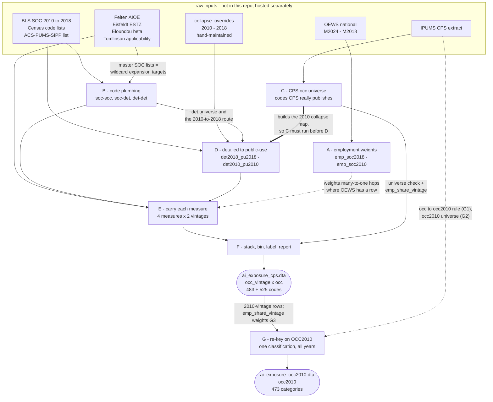

# Building CPS-ready AI-exposure measures

Carries published AI-exposure measures from their native occupation coding onto the occupation codes that actually appear in CPS microdata, and emits one dataset that merges straight onto a CPS extract.

This improves upon the work in [AI and Jobs: The Final Word (Until the Next One)](https://eig.org/ai-and-jobs-the-final-word/)

**Output:** 

`data/processed/ai_exposure_cps.dta` (+ `.csv`), keyed on `occ_vintage` × `occ`.

To use:
```stata
gen occ_vintage = cond(year >= 2020, 2018, 2010)
merge m:1 occ_vintage occ using "$prcd_data/ai_exposure_cps.dta"
```

`data/processed/ai_exposure_occ2010.dta`, keyed on IPUMS `OCC2010`. Contains one occupation classification for all years, at the cost of detail. See **G**.

```stata
merge m:1 occ2010 using "$prcd_data/ai_exposure_occ2010.dta"
```

### What is in each file

`ai_exposure_cps.dta` (+ `.csv`) — 483 rows on the 2010 vintage, 525 on the 2018 vintage:

| variable | what it is |
|---|---|
| `occ_vintage` | which Census code vintage the row describes: 2010 for CPS ≤2019, 2018 for CPS 2020+ |
| `occ` | CPS public-use occupation code (IPUMS `OCC`) |
| `aioe` | Felten et al. (2021) AI Occupational Exposure |
| `estz_total`, `estz_core`, `estz_supp` | Eisfeldt et al. (2023) gen-AI exposure — total, core tasks, supplemental tasks |
| `gpt4_beta`, `human_beta` | Eloundou et al. (2024) β — GPT-4-annotated and human-annotated |
| `ai_applic` | Tomlinson et al. (2025) AI applicability score |
| `*_q_vintage` | quintile of each score. Cutpoints are taken once from the 2018-vintage distribution and applied to both vintages, so the thresholds cannot move at 2020 |
| `nsrc_<measure>` | how many source codes were aggregated into this cell — **final crosswalk hop only** |
| `wtd_<measure>` | how that hop was weighted: 2 = employment-weighted, 1 = unweighted fallback (some contributor had no OEWS employment), 0 = unweighted |
| `nobs` | unweighted CPS records on this code |
| `emp_share_vintage` | share of civilian employment **within this code vintage**, CPS `$cps_yr_min`–`$cps_yr_max` |

`ai_exposure_occ2010.dta` — 473 rows, one per `OCC2010` category:

| variable | what it is |
|---|---|
| `occ2010` | IPUMS `OCC2010`: one occupation classification for every year |
| the same seven scores | identical names and values to the per-vintage file, collapsed onto `occ2010` from its **2010-vintage rows only** |
| `*_q_occ2010` | quintile cut over `occ2010` categories. A **different partition** — bin 5 here is not bin 5 in the other file, so never compare bins across the two |
| `nobs` | unweighted CPS records on this category |
| `emp_share_pooled` | share of civilian employment **pooled over the whole window**, not within a vintage |

Both files count the civilian employed only (`empstat` 10 or 12). Scores are missing, never zero, for occupations a measure never scored.

---

## Improvements over previous version

Four differences, in rough order of how much they move results.

**Wildcards mean "remaining", not "all".**
Census occupation entries often name SOC codes with a placeholder — `49-904X`, `51-91XX` — and the codes that placeholder stands for are the ones *left over* after the list has named its siblings explicitly elsewhere.
Read as "all", a residual category like "Other production workers" absorbs the very codes the list assigns to their own Census codes, so those SOCs get counted twice and the residual score drifts toward its group average.
The current build resolves each placeholder per SOC, longest match wins, and asserts what the classification implies: every detailed SOC lands in exactly one Census code.
This is the largest source of difference, and it lands hardest on the residual "Other …" categories.

**Collapsing is employment-weighted.**
Where several SOC codes fall into one occupation code, the score is the employment-weighted mean rather than a simple average, so a small specialty no longer counts as much as an occupation many times its size.
Aggregate exposure barely moves; what moves is which occupations sit near a bin edge.

**Built on the codes the CPS actually publishes.**
The detailed Census classification contains codes that never appear in the microdata — `1500`, Mining and geological engineers, is valid on paper and absent from CPS — while the CPS publishes collapsed codes that the detailed list does not contain at all.
Scoring the detailed list and merging it onto CPS therefore invents occupations at one end and leaves real ones unscored at the other.
Every collapse here is validated against codes observed in the extract.

**Gaps stay visible.**
An occupation a measure never scored comes through missing rather than as zero or as a silently absent row, so coverage is reportable instead of being quietly folded into the bottom bin.
Bins are cut over the codes that exist and carry a score, and their names say which partition they came from.

## Why there are two ways to match to CPS

The two files answer different questions.
`ai_exposure_cps.dta` carries the most occupational detail the CPS supports, on the codes it actually published in each year — 483 codes before 2020, 525 from 2020 on.
`ai_exposure_occ2010.dta` gives up detail to hold the classification scheme constant.

**Why the `OCC2010` version exists.**
Bins in the per-vintage file are defined over two different code universes, so the January 2020 recoding moves employment across bins with nobody changing jobs.
`code/02_boundary_diagnostic.do` measures it, per measure and under both keyings, from `cpsidp`-linked adjacent months (4.7M links, IPUMS month-to-month weights).
Every measure churns far more at the boundary than in a control December→January, and the sharpest version restricts to workers who report the **same employer** as last month — people who should not change bin at all:

| measure | churn, vintage | churn, `OCC2010` | stayers, vintage | stayers, `OCC2010` | top-bin drift, vintage |
|---|---|---|---|---|---|
| `aioe` | 7.99% | 5.50% | 4.54% | 1.86% | −0.34pp |
| `estz_total` | 11.72% | 5.72% | 8.37% | 1.97% | +2.30pp |
| `estz_core` | 9.29% | 6.07% | 5.55% | 2.18% | −0.03pp |
| `estz_supp` | 12.56% | 5.97% | 9.12% | 2.06% | +0.22pp |
| `gpt4_beta` | 10.92% | 5.51% | 7.52% | 1.76% | +0.68pp |
| `human_beta` | 10.04% | 5.78% | 6.64% | 2.06% | +0.23pp |
| `ai_applic` | 12.18% | 5.75% | 8.85% | 1.93% | +0.07pp |

The control is every other December→January step, and the diagnostic reports its per-year spread rather than only its mean, because the mean alone will mislead you: control churn runs 4.5–5.9% across years for all links and 1.2–1.4% for stayers.
Every per-vintage boundary figure sits outside that spread. On `OCC2010`, `ai_applic`'s 5.75% falls *inside* it, so for that measure the harmonized keying leaves nothing distinguishable from a normal month.

Read the stayer columns first: under the per-vintage keying, 4.5–9.1% of same-employer workers change bin at the boundary against a 1.2–1.4% control — roughly four to seven times a normal month, for people who did not change job. Keying on `OCC2010` cuts that to 1.8–2.2%.
The residual gap is real occupation change plus IPUMS's own back-coding, not the scheme break.
Any statistic that spans the boundary inherits the artifact: a monthly series, an event study around 2020, a difference between pre- and post-2020 periods, or a person-level transition rate.
The cost is 473 categories instead of 525, and post-2020 `OCC2010` values are IPUMS back-codes.

**Why we don't push the 2018 vintage backwards.**
The obvious alternative is to recode pre-2020 records onto 2018-basis codes and use the 2018-vintage scores for every year.
That direction requires *splitting*, and the numbers needed to split do not exist.
Routing the public-use universes into each other through the detailed Census codes (`det2010_pu2010` → `det2010_det2018` → `det2018_pu2018`) shows they do not nest: **58** of the 453 routable 2010-vintage codes land in more than one 2018 public-use code, and those codes hold **16.8%** of 2010-vintage employment.
Backward recoding means taking one observed 2010 code and dividing its workers among several 2018 codes with nothing to say which worker goes where — probabilistic assignment, which this build exists to avoid (see *Design principles*), and the source of the spurious occupation-switching in the original pipeline.
A further **30** of the 483 2010-vintage codes (**2.3%** of employment) have no forward route through the crosswalks at all, so they would have to be dropped or hand-assigned.
And even where a route is clean, the result is a code the CPS never published for those years, which means step C — the validation the rest of the build leans on — has nothing left to check it against.

None of that forbids travelling backwards through the *SOC* codes, and the build does exactly that: Eloundou and Tomlinson are native to SOC 2018, so reaching the 2010 vintage means bridging SOC 2018 → SOC 2010 before the Census hops (do-file, step E).
The distinction is what is being moved.
Backward recoding of CPS public-use codes would divide *workers* among codes the CPS never published for those years; a backward SOC bridge moves *scores*, which are intensive, so a SOC 2018 code that splits into several SOC 2010 codes hands each of them the same score rather than a share of anything.
The cost is compression, not invention: where that split happens, Eloundou and Tomlinson carry identical values across the resulting 2010-basis codes.

Collapsing toward `OCC2010` runs the other way: it *merges* rather than splits, and merging needs only employment weights, which we draw from OEWS and CPS.
Splitting invents information while merging discards it.
That direction is lossy too — **15** of the 525 2018-vintage codes cover more than one 2010-vintage code, **5.8%** of 2018-vintage employment — which is exactly why the harmonized file has 473 categories rather than 525.

The `OCC2010` route still relies on IPUMS having back-coded post-2020 records, so it is not free of backward mapping.
IPUMS applies a documented rule to the underlying detailed coding and maintains it across releases; the alternative would have us invent a crosswalk between two already-collapsed public-use universes.
Step G leans on that by *reading* IPUMS's own collapse off pre-2020 data rather than assuming one.

**Which to use.**
Cross-sectional work, or anything wholly on one side of 2020, belongs on the per-vintage file, where the detail is.
Anything crossing the boundary — time series, event studies, `cpsidp`-linked transitions — belongs on `OCC2010`.
If a specification needs both, run the December→January check in *Suggested diagnostic* before trusting the seam.

## Why it takes six steps

Three facts force the structure:

1. Every published measure is keyed on some **SOC** scheme.
2. The CPS publishes **Census occupation codes**, which are a *collapsed* version of the detailed Census classification.
3. The CPS **switched Census vintages in January 2020**.

So each score has to travel `SOC → detailed Census → CPS public-use code`, once per code vintage, with employment weights applied wherever several codes collapse into one.

| step | does | key output |
|---|---|---|
| **A** | OEWS employment weights | `emp_soc2018.dta`, `emp_soc2010.dta` |
| **B** | code plumbing (SOC↔SOC, SOC→Census) | `soc*_det*.dta`, `det2010_det2018.dta` |
| **C** | which occ codes really exist in CPS | `cps_occ_universe*.dta` |
| **D** | detailed Census → CPS public-use | `det2018_pu2018.dta`, `det2010_pu2010.dta` |
| **E** | measures carried along B then D | `pu_<measure>_<vintage>.dta` |
| **F** | stack, bin, label, report | `ai_exposure_cps.dta` |

**Order matters.** C must precede D, because the 2010 collapse map is *built* against the observed CPS code list, not merely checked against it.

Step **G** sits outside this chain.
It does not help build that file; it rebuilds the finished scores on a single occupation classification, trading detail for a partition that cannot move at 2020.

## How the steps depend on each other

The table above is the reading order.
The dependency graph is not the same shape: A feeds sideways into every aggregation rather than into the next step, and D cannot be reordered ahead of either B or C.



Five edges are worth reading closely:

- **B into D, twice over.** An ordinary data dependency, but easy to miss: `soc2010_det2010.dta` supplies the entire population of detailed 2010 codes that D is trying to map, and `det2010_det2018.dta` is tier (ii)'s routing table.
  Re-running B alone therefore *does* change D's output, and with it the 2010 collapse map.
- **Thick, C into D.** Not a data handoff but a construction dependency: D *builds* the 2010 collapse map against the observed CPS code list.
  Swap the order and the map silently changes.
  Because every step writes to `intermediate_exposure/` with `replace`, running D out of order does not necessarily fail — it may quietly map whatever stale universe is on disk.
- **Dashed, into E and G.** Side inputs, not stages.
  A supplies the weights consumed at the many-to-one hops inside E — though 48 of 867 SOC 2018 codes and 45 of 841 SOC 2010 codes have no OEWS row, so not every hop is actually weighted.
  The CPS extract is read again in G, twice: once over `year <= 2019` to recover IPUMS's own `occ -> occ2010` collapse (G1), and once over all years to build the `occ2010` universe (G2).
- **C into F as well as D.** The same file does double duty: it constructs the map in D, then supplies the employment shares the coverage report needs in F.
- **Measures into B as well as E.** `master_soc2018.dta` and `master_soc2010.dta` are built from the Felten and Eloundou files, and every wildcard expansion in B — plus Tomlinson's broad-group expansion in E — resolves against them.
  A measure file is therefore an input to the code plumbing, not only something the plumbing carries.

Two employment shares travel through this graph, and they are now named apart: `emp_share_vintage` (step C) is a share within one code vintage and is what weights G3, while `emp_share_pooled` (G2) pools the whole window across both vintages and rides along in the harmonized file as a reference column.
Both cover CPS `$cps_yr_min`-`$cps_yr_max` and count the employed only.

Note also that G consumes the *finished* `ai_exposure_cps.dta`, and only its 2010-vintage rows.
Nothing from the 2018 vintage reaches the harmonized file.

---

## A. OEWS employment weights

**In:** `raw/oews/national_M2024_dl.xlsx` (SOC 2018 basis), `national_M2018_dl.xlsx` (SOC 2010 basis)
**Out:** `emp_soc2018.dta`, `emp_soc2010.dta` — `soc` + `emp_wt`

When several SOC codes fall into one Census code, the target's score is their **employment-weighted** mean, not a simple mean, so a 5,000-worker occupation no longer counts as much as a 500,000-worker one.

Column names drift between OEWS vintages (`O_GROUP` vs `OCC_GROUP`); both are handled.

## B. Code plumbing

**In:** `soc_2010_to_2018_crosswalk.xlsx` (BLS), `2018-occupation-code-list-and-crosswalk.xlsx` (Census, two sheets), `census2010_occ_codes_xwalk.xls` (Census)

**Out:**

| file | mapping |
|---|---|
| `soc2010_soc2018.dta` | SOC 2010 ↔ SOC 2018 |
| `master_soc2018/2010.dta` | the real detailed SOC codes (expansion targets) |
| `soc2018_det2018.dta` | SOC 2018 → detailed Census 2018 |
| `soc2010_det2010.dta` | SOC 2010 → detailed Census 2010 |
| `det2010_det2018.dta` | detailed Census 2010 → 2018 |

Census lists name SOC codes three ways, and all three must be expanded to detailed SOCs before anything can merge:

| notation | example | means |
|---|---|---|
| exact | `17-2151` | that code |
| broad group | `29-1020` | everything under `29-102x` |
| wildcard | `17-301X` | the **remaining** codes in the group |

The wildcard case is the subtle one: `X` means *remaining*, not *all*.
`17-301X` excludes `17-3011`, which the Census list assigns explicitly to Census `1541`.
The rule is longest-matching-prefix, resolved **per SOC** so an explicitly named code always beats a wildcard claiming the same SOC.

*Invariant:* each detailed SOC ends up in exactly one Census code — the Census classification is a partition.

## C. CPS occupation universe

**In:** `raw/cps/<extract>.dta`
**Out:** `cps_occ_universe.dta`, `cps_occ_universe_2010.dta`, `cps_occ_universe_2018.dta`

Built from CPS `$cps_yr_min`-`$cps_yr_max` (the window is set once, in `code/0_config.do`) and from the **civilian employed only** — `empstat` 10 or 12.
Conditioning on `occ != 0` alone would keep people who are not employed but carry a last-known occupation — 5.4% of the weighted mass, and unstable: by year it runs between 4.3% and 9.1%, tracking the business cycle and peaking through the pandemic.
A weight that swells with unemployment distorts any series built on it, which is reason enough; the earlier claim that it jumped *at* the vintage boundary was wrong (December 2019 to January 2020 moves 4.07% to 4.73%).
Armed forces (`empstat` 01) are excluded with them, which is why CPS code `9840` is absent from the universe and the military rows in both override files resolve to "exclude".

The only source that knows which Census codes the CPS actually publishes.
Detailed `1500` (Mining and geological engineers) is a perfectly valid 2018 Census code, and the official crosswalk maps `1500 → 1500` — but `1500` appears **zero** times in CPS from 2020 on, because those workers sit inside `1520`.

This file is **load-bearing, not a validation target**: step D uses it to construct the 2010 collapse map.
Rebuild it whenever the CPS extract changes, and record which years feed it — a code that is genuinely rare and happens not to appear in a short window gets treated as "not a CPS code" and its content routed elsewhere.

## D. Detailed Census → CPS public-use codes

**In:** `acs_pums_sipp_2018_occ_codes.xlsx` (the `Combines:` blocks), `collapse_overrides_2018.csv`, `collapse_overrides_2010.csv`, `soc2010_det2010.dta`, `det2010_det2018.dta`, `cps_occ_universe_*.dta`

`soc2010_det2010.dta` — not the raw Census file — is what defines the 538 detailed 2010 codes this step works over, so the tier counts in the log are relative to a step-B artifact.
**Out:** `det2018_pu2018.dta`, `det2010_pu2010.dta`

The CPS file is a collapsed version of the detailed Census list: of 570 detailed 2018 codes, 40 collapse into a different code and 5 have no public-use target at all, so 45 are never used as their own code; of 540 detailed 2010 codes the split is 52 and 5, so 57.
Mapping exposure onto them manufactures occupations that exist in one half of the sample and not the other.

- **2018 vintage** — from the Census ACS/SIPP public-use code list, whose `Combines:` blocks state exactly which detailed codes sit inside each public-use code.
  Reproduces the observed CPS universe **exactly (525/525)**, with the military block excluded through the override file.
- **2010 vintage** — Census publishes no equivalent list, so three tiers in order: self-map if CPS uses the code; else route `det2010 → det2018 → public-use 2018` and accept if the result is a valid 2010-vintage CPS code; else the hand-reviewable override CSV.
  Result **483/483**, nothing unmapped.

## E. Exposure measures

**In:**

| measure | file | native scheme |
|---|---|---|
| Felten et al. (2021) AIOE | `AIOE_DataAppendix.xlsx` | SOC 2010 |
| Eisfeldt et al. (2023) ESTZ | `genaiexp_estz_occscores.csv` | SOC 2010 |
| Eloundou et al. (2024) β | `gptsRgpts_occ_lvl.csv` | O\*NET-SOC 2018 |
| Tomlinson et al. (2025) AI applicability | `ai_applicability_scores.csv` | SOC 2018 |

**Out:** `score_*_soc20xx.dta` → `pu_<measure>_<vintage>.dta`

Each score is read natively, bridged across SOC vintages only where the target vintage needs it, then carried through B and D.

Scores are treated as **intensive** quantities: copied when one source code feeds many targets (an exposure index is not a headcount, so it is not divided up), and employment-weighted-averaged when many sources feed one target.
A score is never multiplied by a weight, so published scales survive intact.

**One wrinkle in the Tomlinson file.**
7 of its 785 rows are broad SOC groups rather than detailed codes — `13-1020`, `13-2020`, `29-2010`, `31-1120`, `39-7010`, `47-4090`, `51-2090`.
Every crosswalk built in B is keyed on detailed SOC, so left alone those rows merge to nothing and their members arrive unscored, and `31-1120` is Home Health and Personal Care Aides — one of the largest occupations in the CPS.
Each group is therefore expanded to its detailed members with the score **copied**, the same one-source-to-many-targets rule the rest of this step already applies, taking 785 published rows to 793 SOC 2018 codes.
No detailed member of any of the 7 groups is scored separately in the source file, so nothing explicit is overwritten.

## F. Assemble

**Out:** `data/processed/ai_exposure_cps.dta` (+ `.csv`)
**Key:** `occ_vintage` (2010 | 2018) + `occ`

- Measures are **merged within** a vintage, then the vintages **appended**.
  The reverse order silently fails: once a score variable exists in the master data, a plain `merge` will not fill it for newly matched rows, so every measure after the first comes through missing for the second vintage.
- Quintile cutpoints (unweighted) are taken **once** from the 2018-vintage distribution and applied to both, so the thresholds themselves cannot move at 2020.
- Ends with a coverage report: share of employment carrying a score, per vintage, and the break between them.

## G. Harmonized `OCC2010` file

**In:** `ai_exposure_cps.dta` (2010-vintage rows only), `raw/cps/<extract>.dta` (`year`, `occ`, `occ2010`, `wtfinl`)
**Out:** `data/processed/ai_exposure_occ2010.dta`, `cps_occ2010_universe.dta`
**Key:** `occ2010` alone — no vintage variable, so no vintage indicator to build

```stata
merge m:1 occ2010 using "$prcd_data/ai_exposure_occ2010.dta"
```

A–F put exposure on the codes the CPS actually publishes, which means two code universes and a bin structure that shifts in January 2020.
G takes the finished file and rebuilds it on IPUMS `OCC2010`, one classification for every year, so the partition itself is constant.
Use it for anything that spans the boundary.

| sub-step | does |
|---|---|
| **G1** | learn the `occ → occ2010` collapse from CPS `year <= 2019` |
| **G2** | `occ2010` universe and employment shares, all years |
| **G3** | collapse the 2010-vintage scores onto `occ2010` |
| **G4** | quintiles once, over `occ2010` categories |
| **G5** | attach the universe, report coverage, save |

**G1 reads the rule off the data rather than assuming one.** Pre-2020 `occ` is already 2010-basis, so tabulating `occ × occ2010` on `year <= 2019` recovers IPUMS's own collapse.
Ties break to the `wtfinl`-modal category, but over this extract there are none: no `occ` maps to more than one `occ2010`.

**G3 weights by CPS employment share**, not OEWS employment, because both sides of this hop are CPS codes and the shares are already in hand from G2.

**G4 is the whole point.** One classification gives one set of cutpoints, so membership cannot move at 2020 — compare F, which has to freeze 2018-vintage cutpoints and still bins two different code universes.

Two things to know before using it:

- **The bins are a different partition, and are named for it.** This file carries `*_q_occ2010`, cut over occ2010 categories; the per-vintage file carries `*_q_vintage`, cut over 2018-vintage occupation codes.
  Bin 5 in one is not bin 5 in the other, so never pool or compare them across files.
- **Every score comes from the 2010-vintage build.** The 2018-vintage columns are not used at all.
  For 2020+ observations IPUMS back-codes `occ2010`, and the worker inherits the 2010-basis score.
  That inheritance is exactly what buys the constant partition.
- **Coverage:** 465 of 473 `occ2010` categories carry at least one score; the 8 that carry none hold **0.58%** of employment.
  Per measure the gap is wider than that: `aioe` is missing for 11 categories (0.76% of employment) and `ai_applic` for 9 (1.33%), the rest for 8 (0.58%).
  The build prints all three counts, because they are different questions — only **one** category is absent from the collapsed score file altogether, and quoting that number as if it were the coverage gap is how an earlier version of this line came to claim "0.00% of employment".

What it buys, from `code/02_boundary_diagnostic.do`: boundary bin churn falls from 8.0–12.6% to 5.5–6.1% depending on the measure, against control steps that range to 5.9%, and among same-employer stayers from 4.5–9.1% to 1.8–2.2% against a 1.2–1.4% control.
Net top-bin drift, which ranges from −0.34pp to +2.30pp across measures under the per-vintage keying, falls to at most 0.30pp.
The cost is 473 categories instead of 525.

---

## Design principles

**No probabilistic assignment.** Exposure is built natively on 2010-basis codes for ≤2019 and 2018-basis codes for 2020+.
No worker is ever randomly reassigned to a new code, so there is no spurious occupation-switching and no seed dependence.

**Public-use code universe, not the detailed Census list.** Every collapse is validated against codes observed in real CPS microdata.

**Scores keep their published scale.** See E.

---

## Known limitations

**Residual "all other" occupations are unscored.** Felten's appendix omits 67 of 840 SOC 2010 codes, 30 of them residual categories O\*NET never scored, so codes like `2014` (Social workers, all other) and `4965` (Sales workers, all other) cannot be reached.
Coverage is ~99% of employment in each vintage, and switching measures does not close the gap: of 841 detailed SOC 2010 codes, Felten scores 774 and Eisfeldt 778, but Eisfeldt reaches only **9** of the codes Felten misses.
**58 codes are scored by neither**, which is why the residual categories stay unreachable whichever of the two you use.

**Bin membership shifts at the 2020 recoding.** Because the two vintages bin workers on different code universes (483 codes, then 525), the January 2020 recoding moves employment across bins with nobody changing job.
Person-linked CPS records show **8.0–12.6%** of workers changing bin at the boundary against control December→January steps that range to **5.9%** across years, and **4.5–9.1%** of *same-employer* workers against a **1.2–1.4%** control.
Net top-bin drift is largest by far for `estz_total` (**+2.30pp**).
The other measures land below half a point in either direction, and the diagnostic reports no standard errors, so those signs should not be read as results — there is no single number for "the drift", and a specification leaning on aggregate direction needs its own measure checked with uncertainty attached.
Aggregates that span the moving boundary — top-two-bins combined, or the continuous mean — hide this almost entirely, so check individual bins.

*If this matters for your specification,* use the harmonized file from step G. `ai_exposure_occ2010.dta` keys on IPUMS `OCC2010`, one classification for all years, which brings churn to 5.5–6.1% against a 4.8–5.3% control and drift to 0.30pp or less.
Costs occupational detail (473 categories instead of 525).
Crosswalk-derived common partitions do **not** fix it — the CPS recoding does not respect crosswalk boundaries.

**Tomlinson coverage is slightly thinner than the others.**
`ai_applic` reaches 475 of 483 codes on the 2010 vintage and 511 of 525 on the 2018 vintage — 98.9% and 98.5% of employment, against ~99% for the rest.
Its **−0.4pp** break across 2020 is the smallest of any measure in the file.

**The universe window may be narrower than the analysis window.** Check which CPS years feed step C against the years you actually analyse.

---

## Suggested diagnostic

The test that detects a coding artifact is the December→January step in each bin's employment share, **with non-boundary Januaries as the control**.
That test is now `code/02_boundary_diagnostic.do`, so run it rather than reconstructing it — and note what it shows: the cross-sectional monthly step is the *weakest* of the three tests.
For `aioe` the boundary step is 0.14pp while the largest step elsewhere in the series is 2.07pp, so the break is invisible in that statistic even though person-linked churn is plainly elevated.
Only `estz_total` has its largest monthly step at the boundary (2.48pp against 1.80pp elsewhere).
Person-level links via `cpsidp` sharpen it further, since a worker whose job did not change should not change bin.

