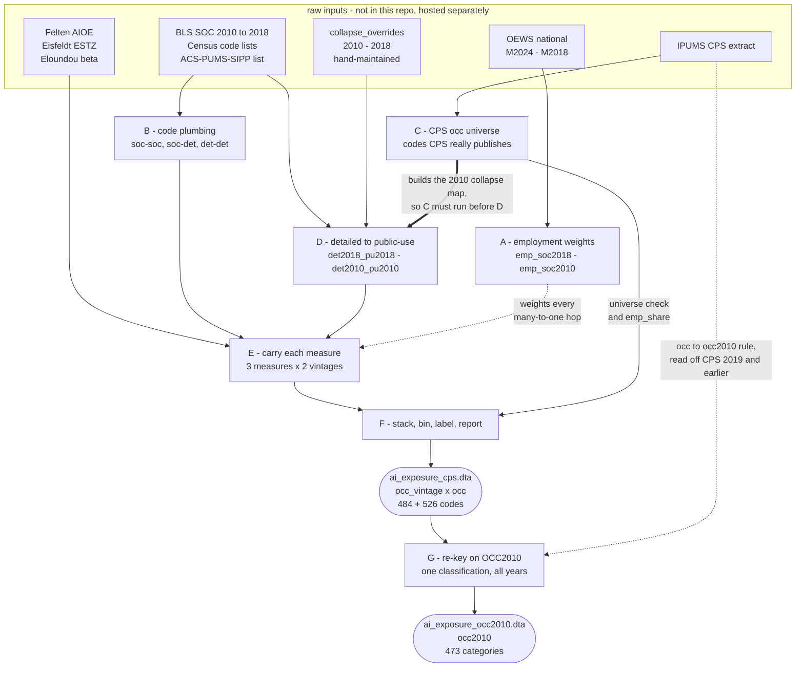

# Building the AI-exposure measures

Carries published AI-exposure measures from their native occupation coding onto the occupation codes that actually appear in CPS microdata, and emits one dataset that merges straight onto a CPS extract.

**Output:** `data/processed/ai_exposure_cps.dta` (+ `.csv`), keyed on `occ_vintage` × `occ`.

```stata
gen occ_vintage = cond(year >= 2020, 2018, 2010)
merge m:1 occ_vintage occ using "$prcd_data/ai_exposure_cps.dta"
```

A second output, `ai_exposure_occ2010.dta`, keys on IPUMS `OCC2010` instead — one occupation classification for all years, at the cost of detail.
See **G**.

---

## Why it takes six steps

Three facts force the structure:

1. Every published measure is keyed on some **SOC** scheme.
2. The CPS publishes **Census occupation codes**, which are a *collapsed* version of the detailed Census classification.
3. The CPS **switched Census vintages in January 2020**.

So each score has to travel `SOC → detailed Census → CPS public-use code`, once per code vintage, with employment weights applied wherever several codes collapse into one.

| step | does | key output |
|---|---|---|
| **A** | OEWS employment weights | `emp_soc2018.dta`, `emp_soc2010.dta` |
| **B** | code plumbing (SOC↔SOC, SOC→Census) | `soc*_det*.dta`, `det2010_det2018.dta` |
| **C** | which occ codes really exist in CPS | `cps_occ_universe*.dta` |
| **D** | detailed Census → CPS public-use | `det2018_pu2018.dta`, `det2010_pu2010.dta` |
| **E** | measures carried along B then D | `pu_<measure>_<vintage>.dta` |
| **F** | stack, bin, label, report | `ai_exposure_cps.dta` |

**Order matters.** C must precede D, because the 2010 collapse map is *built* against the observed CPS code list, not merely checked against it.

Step **G** sits outside this chain.
It does not help build that file; it rebuilds the finished scores on a single occupation classification, trading detail for a partition that cannot move at 2020.

## How the steps depend on each other

The table above is the reading order.
The dependency graph is not the same shape: A feeds sideways into every aggregation rather than into the next step, and the one edge that cannot be reordered is C into D.



Three edges are worth reading closely:

- **Thick, C into D.** Not a data handoff but a construction dependency: D *builds* the 2010 collapse map against the observed CPS code list.
  Swap the order and the map silently changes.
- **Dashed, into E and G.** Side inputs, not stages.
  A supplies the weights consumed at every many-to-one hop inside E; the CPS extract is read a second time in G to recover IPUMS's own `occ -> occ2010` collapse.
- **C into F as well as D.** The same file does double duty: it constructs the map in D, then supplies the employment shares the coverage report needs in F.

Note also that G consumes the *finished* `ai_exposure_cps.dta`, and only its 2010-vintage rows.
Nothing from the 2018 vintage reaches the harmonized file.

---

## A. OEWS employment weights

**In:** `raw/oews/national_M2024_dl.xlsx` (SOC 2018 basis), `national_M2018_dl.xlsx` (SOC 2010 basis)
**Out:** `emp_soc2018.dta`, `emp_soc2010.dta` — `soc` + `emp_wt`

When several SOC codes fall into one Census code, the target's score is their **employment-weighted** mean, not a simple mean, so a 5,000-worker occupation no longer counts as much as a 500,000-worker one.

Column names drift between OEWS vintages (`O_GROUP` vs `OCC_GROUP`); both are handled.
A missing file is not fatal — that vintage falls back to unweighted means and says so, with `wtd_*` recording where it happened.

## B. Code plumbing

**In:** `soc_2010_to_2018_crosswalk.xlsx` (BLS), `2018-occupation-code-list-and-crosswalk.xlsx` (Census, two sheets), `census2010_occ_codes_xwalk.xls` (Census)

**Out:**

| file | mapping |
|---|---|
| `soc2010_soc2018.dta` | SOC 2010 ↔ SOC 2018 |
| `master_soc2018/2010.dta` | the real detailed SOC codes (expansion targets) |
| `soc2018_det2018.dta` | SOC 2018 → detailed Census 2018 |
| `soc2010_det2010.dta` | SOC 2010 → detailed Census 2010 |
| `det2010_det2018.dta` | detailed Census 2010 → 2018 |

Census lists name SOC codes three ways, and all three must be expanded to detailed SOCs before anything can merge:

| notation | example | means |
|---|---|---|
| exact | `17-2151` | that code |
| broad group | `29-1020` | everything under `29-102x` |
| wildcard | `17-301X` | the **remaining** codes in the group |

The wildcard case is the subtle one: `X` means *remaining*, not *all*.
`17-301X` excludes `17-3011`, which the Census list assigns explicitly to Census `1541`.
The rule is longest-matching-prefix, resolved **per SOC** so an explicitly named code always beats a wildcard claiming the same SOC.

*Invariant:* each detailed SOC ends up in exactly one Census code — the Census classification is a partition.
Asserted with `isid`.

## C. CPS occupation universe

**In:** `raw/cps/<extract>.dta`
**Out:** `cps_occ_universe.dta`, `cps_occ_universe_2010.dta`, `cps_occ_universe_2018.dta`

The only source that knows which Census codes the CPS actually publishes.
Detailed `1500` (Mining and geological engineers) is a perfectly valid 2018 Census code, and the official crosswalk maps `1500 → 1500` — but `1500` appears **zero** times in CPS from 2020 on, because those workers sit inside `1520`.

This file is **load-bearing, not a validation target**: step D uses it to construct the 2010 collapse map.
Rebuild it whenever the CPS extract changes, and record which years feed it — a code that is genuinely rare and happens not to appear in a short window gets treated as "not a CPS code" and its content routed elsewhere.

## D. Detailed Census → CPS public-use codes

**In:** `acs_pums_sipp_2018_occ_codes.xlsx` (the `Combines:` blocks), `collapse_overrides_2018.csv`, `collapse_overrides_2010.csv`, `det2010_det2018.dta`, `cps_occ_universe_*.dta`
**Out:** `det2018_pu2018.dta`, `det2010_pu2010.dta`

The CPS file is a collapsed version of the detailed Census list: 45 detailed 2018 codes and 57 detailed 2010 codes are never used.
Mapping exposure onto them manufactures occupations that exist in one half of the sample and not the other.

- **2018 vintage** — from the Census ACS/SIPP public-use code list, whose `Combines:` blocks state exactly which detailed codes sit inside each public-use code.
  Reproduces the observed CPS universe **exactly (526/526)** apart from the military block, handled by the override file.
- **2010 vintage** — Census publishes no equivalent list, so three tiers in order: self-map if CPS uses the code; else route `det2010 → det2018 → public-use 2018` and accept if the result is a valid 2010-vintage CPS code; else the hand-reviewable override CSV.
  Result **484/484**, nothing unmapped.

## E. Exposure measures

**In:**

| measure | file | native scheme |
|---|---|---|
| Felten et al. (2021) AIOE | `AIOE_DataAppendix.xlsx` | SOC 2010 |
| Eisfeldt et al. (2023) ESTZ | `genaiexp_estz_occscores.csv` | SOC 2010 |
| Eloundou et al. (2024) β | `gptsRgpts_occ_lvl.csv` | O\*NET-SOC 2018 |

**Out:** `score_*_soc20xx.dta` → `pu_<measure>_<vintage>.dta`

Each score is read natively, bridged across SOC vintages only where the target vintage needs it, then carried through B and D.

Scores are treated as **intensive** quantities: copied when one source code feeds many targets (an exposure index is not a headcount, so it is not divided up), and employment-weighted-averaged when many sources feed one target.
A score is never multiplied by a weight, so published scales survive intact.

## F. Assemble

**Out:** `data/processed/ai_exposure_cps.dta` (+ `.csv`)
**Key:** `occ_vintage` (2010 | 2018) + `occ`

- Measures are **merged within** a vintage, then the vintages **appended**.
  The reverse order silently fails: once a score variable exists in the master data, a plain `merge` will not fill it for newly matched rows, so every measure after the first comes through missing for the second vintage.
- Quintile cutpoints are taken **once** from the 2018-vintage distribution and applied to both, so the thresholds themselves cannot move at 2020.
- Ends with a coverage report: share of employment carrying a score, per vintage, and the break between them.

## G. Harmonized `OCC2010` file

**In:** `ai_exposure_cps.dta` (2010-vintage rows only), `raw/cps/<extract>.dta` (`year`, `occ`, `occ2010`, `wtfinl`)
**Out:** `data/processed/ai_exposure_occ2010.dta`, `cps_occ2010_universe.dta`
**Key:** `occ2010` alone — no vintage variable, so no vintage indicator to build

```stata
merge m:1 occ2010 using "$prcd_data/ai_exposure_occ2010.dta"
```

A–F put exposure on the codes the CPS actually publishes, which means two code universes and a bin structure that shifts in January 2020.
G takes the finished file and rebuilds it on IPUMS `OCC2010`, one classification for every year, so the partition itself is constant.
Use it for anything that spans the boundary.

| sub-step | does |
|---|---|
| **G1** | learn the `occ → occ2010` collapse from CPS `year <= 2019` |
| **G2** | `occ2010` universe and employment shares, all years |
| **G3** | collapse the 2010-vintage scores onto `occ2010` |
| **G4** | quintiles once, over `occ2010` categories |
| **G5** | attach the universe, report coverage, save |

**G1 reads the rule off the data rather than assuming one.** Pre-2020 `occ` is already 2010-basis, so tabulating `occ × occ2010` on `year <= 2019` recovers IPUMS's own collapse.
Ties break to the `wtfinl`-modal category, but over this extract there are none: no `occ` maps to more than one `occ2010`.

**G3 weights by CPS employment share**, not OEWS employment, because both sides of this hop are CPS codes and the shares are already in hand from G2.

**G4 is the whole point.** One classification gives one set of cutpoints, so membership cannot move at 2020 — compare F, which has to freeze 2018-vintage cutpoints and still bins two different code universes.

Two things to know before using it:

- **Every score comes from the 2010-vintage build.** The 2018-vintage columns are not used at all.
  For 2020+ observations IPUMS back-codes `occ2010`, and the worker inherits the 2010-basis score.
  That inheritance is exactly what buys the constant partition.
- **Coverage:** 472 of 473 `occ2010` categories carry a score, and the one gap is 0.00% of employment.
  One 2010-vintage `occ` code has no `occ2010` mapping and drops out — it appears as `_mh == 1` in the log.

What it buys, from the person-linked diagnostic: **5.84%** of workers change bin at the boundary against **5.37%** in a control December→January, with **+0.09pp** net drift, and the largest monthly bin step falls from **1.65pp** to **0.52pp**.
The cost is 473 categories instead of 526.

---

## Design principles

**No probabilistic assignment.** Exposure is built natively on 2010-basis codes for ≤2019 and 2018-basis codes for 2020+.
No worker is ever randomly reassigned to a new code, so there is no spurious occupation-switching and no seed dependence.

**Public-use code universe, not the detailed Census list.** Every collapse is validated against codes observed in real CPS microdata.

**Scores keep their published scale.** See E.

---

## Known limitations

**Residual "all other" occupations are unscored.** Felten's appendix omits 67 of 840 SOC 2010 codes, 30 of them residual categories O\*NET never scored, so codes like `2014` (Social workers, all other) and `4965` (Sales workers, all other) cannot be reached.
Coverage is ~99% of employment in each vintage; Eisfeldt covers all 840 SOC codes.

**Bin membership shifts at the 2020 recoding.** Because the two vintages bin workers on different code universes (484 codes, then 526), the January 2020 recoding moves employment across bins with nobody changing job.
Person-linked CPS records show **11.05%** of workers changing bin at the boundary versus **5.37%** in a normal December→January, with a **+0.70pp** net drift into the top bin.
Aggregates that span the moving boundary — top-two-bins combined, or the continuous mean — hide this almost entirely, so check individual bins.

*If this matters for your specification,* use the harmonized file from step G. `ai_exposure_occ2010.dta` keys on IPUMS `OCC2010`, one classification for all years, which gives 5.84% churn and +0.09pp drift — i.e. a normal month.
Costs occupational detail (473 categories instead of 526).
Crosswalk-derived common partitions do **not** fix it — the CPS recoding does not respect crosswalk boundaries.

**The universe window may be narrower than the analysis window.** Check which CPS years feed step C against the years you actually analyse.

---

## Suggested diagnostic

The test that detects a coding artifact is the December→January step in each bin's employment share, **with non-boundary Januaries as the control**.
Normal years land at 0.11–0.44pp; a coding break shows up as several times that, at exactly `2019m12 → 2020m1`.
Person-level links via `cpsidp` sharpen it further, since a worker whose job did not change should not change bin.

